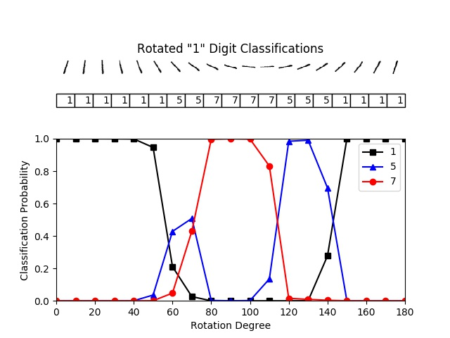
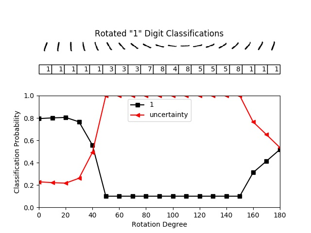
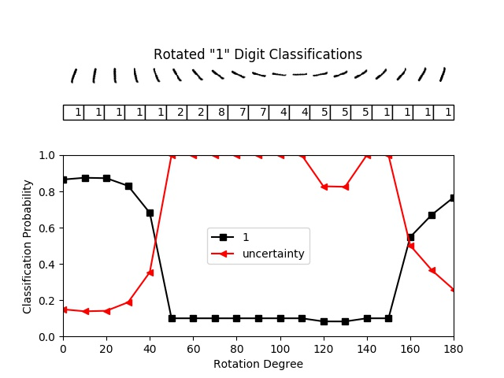
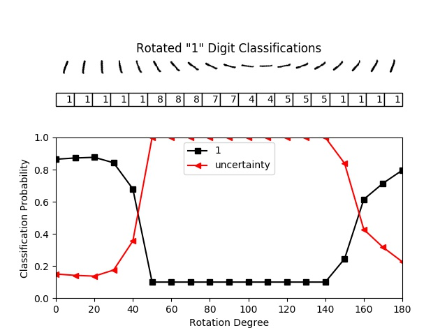
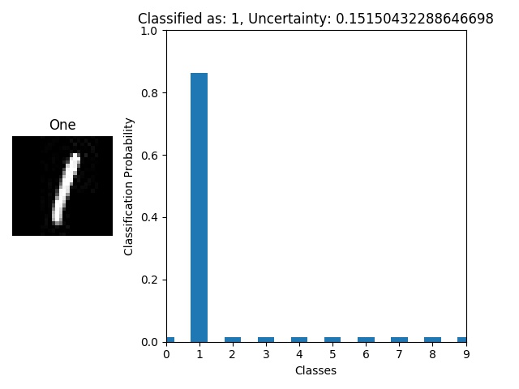
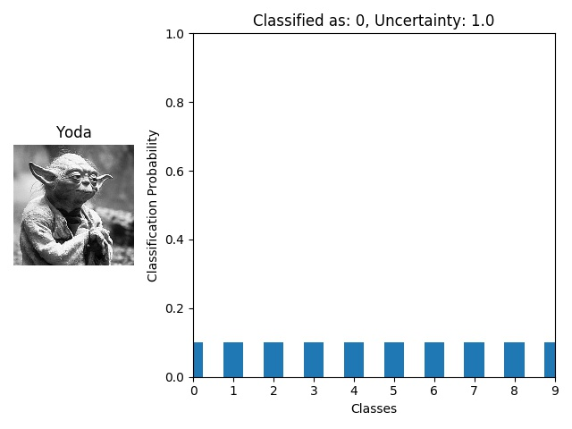

# Evidential Deep Learning to Quantify Classification Uncertainty

[](https://arxiv.org/abs/1806.01768)

The purpose of this repository is to provide an easy-to-run demo using PyTorch with low computational requirements for the ideas proposed in the paper *Evidential Deep Learning to Quantify Classification Uncertainty*. The authors of the paper originally used Tensorflow in their implementation.

The paper can be accessed over at: [http://arxiv.org/abs/1806.01768](http://arxiv.org/abs/1806.01768)

Part of: [Advances in Neural Information Processing Systems 31 (NIPS 2018)](https://papers.nips.cc/book/advances-in-neural-information-processing-systems-31-2018)

## 📝 Table of Contents
- [About](#about)
- [Paper Abstract](#abstract)
- [Authors](#authors)
- [Demonstration](#demonstration)
- [Usage](#usage)
- [License](./LICENSE)
- [Requirements](./requirements.txt)

## 🧐 About <a name = "about"></a>
The purpose of this repository is to provide an easy-to-run demo using PyTorch with low computational requirements for the ideas proposed in the paper *Evidential Deep Learning to Quantify Classification Uncertainty*. The authors of the paper originally used Tensorflow in their implementation.

The paper can be accessed over at: [http://arxiv.org/abs/1806.01768](http://arxiv.org/abs/1806.01768)

Part of: [Advances in Neural Information Processing Systems 31 (NIPS 2018)](https://papers.nips.cc/book/advances-in-neural-information-processing-systems-31-2018)

## 📚 Paper Abstract <a name = "abstract"></a>

Deterministic neural nets have been shown to learn effective predictors on a wide range of machine learning problems. However, as the standard approach is to train the network to minimize a prediction loss, the resultant model remains ignorant to its prediction confidence. Orthogonally to Bayesian neural nets that indirectly infer prediction uncertainty through weight uncertainties, we propose explicit modeling of the same using the theory of subjective logic. By placing a Dirichlet distribution on the class probabilities, we treat predictions of a neural net as subjective opinions and learn the function that collects the evidence leading to these opinions by a deterministic neural net from data. The resultant predictor for a multi-class classification problem is another Dirichlet distribution whose parameters are set by the continuous output of a neural net. We provide a preliminary analysis on how the peculiarities of our new loss function drive improved uncertainty estimation. We observe that our method achieves unprecedented success on detection of out-of-distribution queries and endurance against adversarial perturbations.

## ✍️ Authors <a name = "authors"></a>
Original Paper authors:
- [Murat Sensoy](https://papers.nips.cc/author/murat-sensoy-11083)
- [Lance Kaplan](https://papers.nips.cc/author/lance-kaplan-11084)
- [Melih Kandemir](https://papers.nips.cc/author/melih-kandemir-11085)

Code for this repository:
- [Douglas Brion](https://github.com/dougbrion)

## 🏁 Demonstration <a name = "demonstration"></a>

### Classification with Softmax Cross Entropy Loss Neural Network

The current standard for deep neural networks is to use the softmax operator to convert the continuous activations of the output layer to class probabilities.

The following demonstrates how softmax based Deep Neural Networks fail when they encounter out-of-sample queries.

The test accuracy for the network after 50 epochs is around 98.9%. Now, we want to classify a rotating digit from MNIST dataset to see how this network does for the samples that are not from the training set distribution.

For small degrees of rotation, the image is correctly classified as a "1" with high probability values. However, when the image is rotated by a larger amount the classification probability computed using the softmax function is still high even though the samples have been misclassified.

<div align="center">
 

 
<b>Standard Network without Uncertainty</b>
</div>

As shown above, a neural network trained to generate softmax probabilities fails significantly when it encounters a sample that is different from the training examples. The softmax forces neural network to pick one class, even though the object belongs to an unknown category. This is demonstrated when we rotate the digit one between 60 and 130 degrees. The network classifies the digit incorrectly as either a 5 or 7 while in this range, and with a high classification probability.

### Classification with uncertainty using Expected Mean Square Error

Ideally, we want a network to be "unsure" while trying to classify these objects that belong to an unkown category. Making the network say, *I do not know*, can be achieved by assigning all belief masses to the whole frame.

As described in the paper, a neural network can be trained to learn parameters of a Dirichlet distribution, instead of softmax probabilities. Dirichlet distributions with parameters  `α ≥ 1` behaves like a generative model for softmax probabilities (categorical distributions). It associates a likelihood value with each categorical distribution.

<div align="center">
  
  
  
  <b>Expected Mean Square Error</b>
</div>

The figure above indicates that the proposed approach generates much smaller amount of evidence for the misclassified samples than the correctly classified ones. The uncertainty of the misclassified samples is high, around 1.0, while it is around 0.2 for the correctly classified ones, both for training and testing sets. This means that the neural network is very uncertain for the misclassified samples and provides certain predictions only for the correctly classified ones. In other words, the neural network also predicts when it fails by assigning high uncertainty to its wrong predictions.

The network above is trained using Eq. 5 in the paper. This loss function 

### Classification with uncertainty using Expected Cross Entropy

In this section, we train neural network using the loss function described in Eq. 4 in the paper. This loss function is derived using the expected value of the cross entropy loss over the predicted Dirichlet distribution.

<div align="center">
 
  
  
  <b>Expected Cross Entropy</b>
</div>


The figure above indicates that the neural network generates much more evidence for the correctly classified samples. As a result, it has a very low uncertainty (around zero) for the correctly classified samples, while the uncertainty is very high (around 0.7) for the misclassified samples.

### Classification with uncertainty using Negative Log of the Expected Likelihood

In this section, we repeat our experiments using the loss function based on Eq. 3 in the paper.

<div align="center">



<b>Negative Log of the Expected Likelihood</b>
</div>

## Comparing in sample and out of sample classification

Here you can see how the network responds to a completely random image, in this case of Master Yoda... The network has an uncertainty of 1.0 and has given equal probability to all classes. Comparing this to the "One" digit, we can see that the uncertainty for the in sample image is much lower at around 0.15 and that here is a high confidence of it being a one with a classification probability of approximately 0.86.


MNIST One Digit             |  Random Image of Yoda
:-------------------------:|:-------------------------:
  |  


## 🎈 Usage <a name = "usage"></a>

After cloning this repo you need to install the requirements:
This has been tested with Python `v3.6.8`, Torch `v1.3.1` and Torchvision `v0.4.2`.

```shell
pip install -r requirements.txt
```

The are various arguments available for training and testing the network in addition to showing example data. When training or testing with uncertainty provide the `--uncertainty` argument in addition to one of the following for loss: `--mse`, `--digamma`, `--log`.

```
python main.py --help

usage: main.py [-h] [--train] [--epochs EPOCHS] [--dropout] [--uncertainty]
               [--mse] [--digamma] [--log] [--test] [--examples]

optional arguments:
  -h, --help       show this help message and exit
  --train          To train the network.
  --epochs EPOCHS  Desired number of epochs.
  --dropout        Whether to use dropout or not.
  --uncertainty    Use uncertainty or not.
  --mse            Set this argument when using uncertainty. Sets loss
                   function to Expected Mean Square Error.
  --digamma        Set this argument when using uncertainty. Sets loss
                   function to Expected Cross Entropy.
  --log            Set this argument when using uncertainty. Sets loss
                   function to Negative Log of the Expected Likelihood.
  --test           To test the network.
  --examples       To example MNIST data.
```

Example of how to train the network:

```shell
python main.py --train --dropout --uncertainty --mse --epochs 50
```


Example of how to test the network:

```shell
python main.py --test --uncertainty --mse
```


